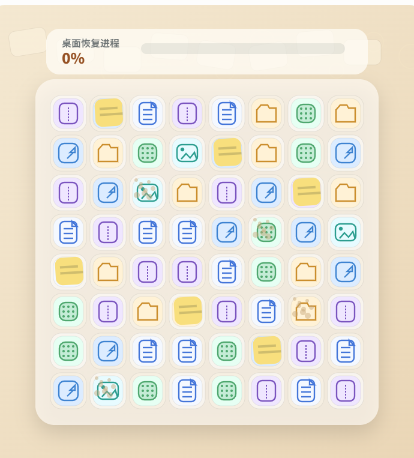

# 桌面整理大师 MVP

当前目录包含一个无依赖的静态 Web 版本，已经从单文件原型升级成可继续扩展的 2D MVP。


## 已实现内容

* `4` 个章节、`16` 个主线关卡
* 章节总览与章节进度
* 首次进入章节的主题过场卡
* 全局进度 HUD、总星级与章节完成统计
* UI 会随当前章节切换主题强调色
* 结算页与章节过场带入场动画和逐颗星级点亮
* 高连锁会触发棋盘爆发条幅、冲击闪光和更强粒子反馈
* `8x8` 三消棋盘
* 指定文件清理目标
* 灰尘 / 便签 / 弹窗障碍
* 批量归档 / 磁盘清扫 / 全盘搜索
* 整洁度推进与桌面恢复
* 章节关卡切换
* 章节完成结算页与全部通关结算页
* 本地进度保存
* 一键重置进度，保留设置项
* 最近事件面板，记录提示、洗牌、结算等关键节点
* 章节页与结算页带主题徽记带
* 滑动交换和点击交换
* 移动端按钮与弹层布局细化
* 基础音效与设置切换
* 核心逻辑自检脚本

## 启动方式

推荐使用本地静态服务：

```bash
python -m http.server 4173
```

然后打开：

```text
http://127.0.0.1:4173
```

## 逻辑自检

```bash
npm run check:core
```

或者：

```bash
node check-core.mjs
```

## 文件结构

* `index.html`: 页面结构
* `styles.css`: 样式
* `app.js`: 前端控制层、Canvas 渲染、动画与交互
* `game-core.js`: 纯逻辑层
* `levels.js`: 关卡配置与图标定义
* `audio.js`: 简单 Web Audio 音效
* `check-core.mjs`: 核心逻辑自检

## 当前建议下一步

如果继续往正式产品推进，优先级建议是：

* 增加更细的关卡内容和章节数
* 接入真实美术资源替换 Canvas 图标
* 为章节过场和结算页补充更强的粒子、音频和镜头包装
* 做移动端更完整的触控反馈与手势容错
